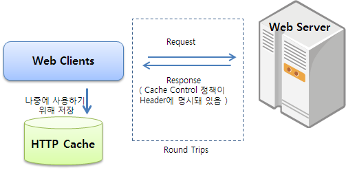
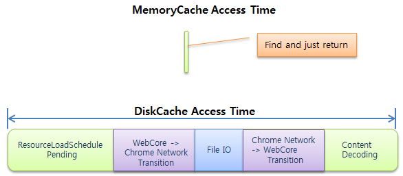
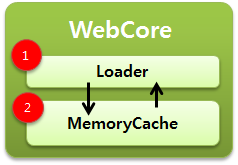
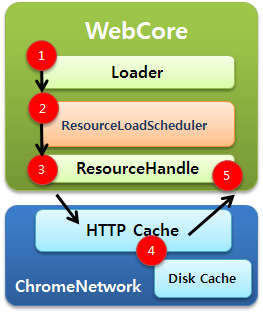
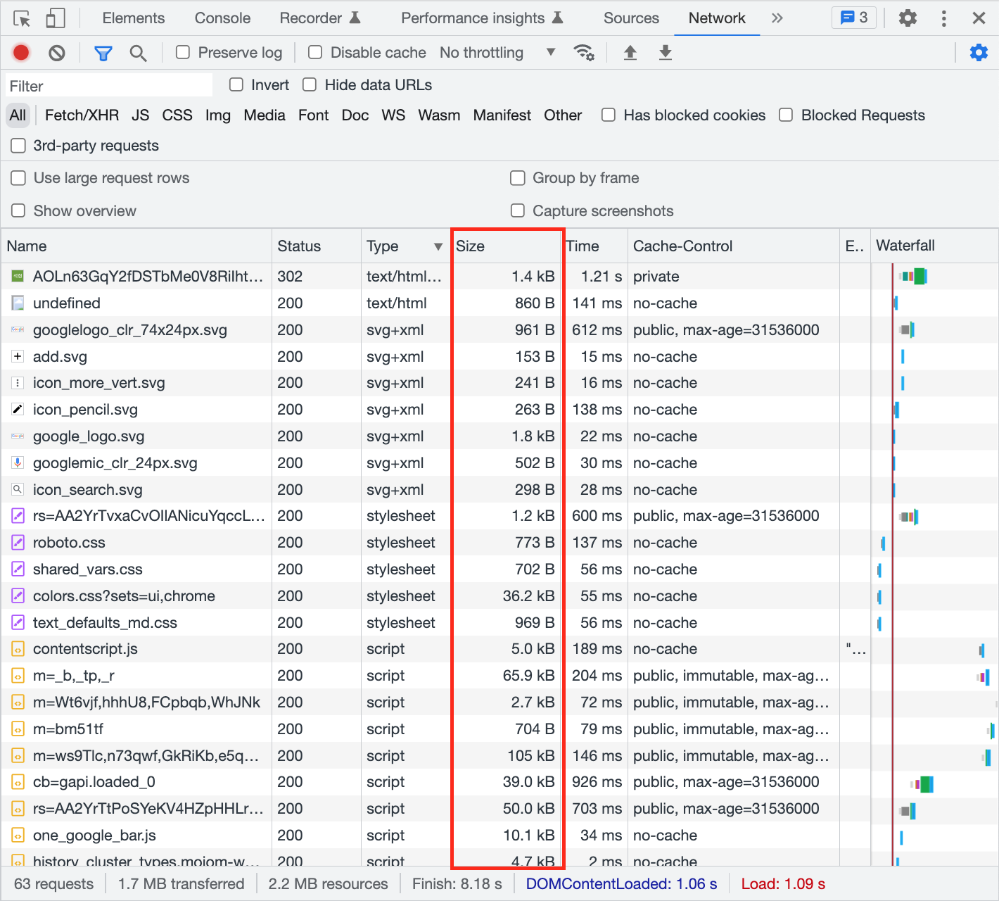
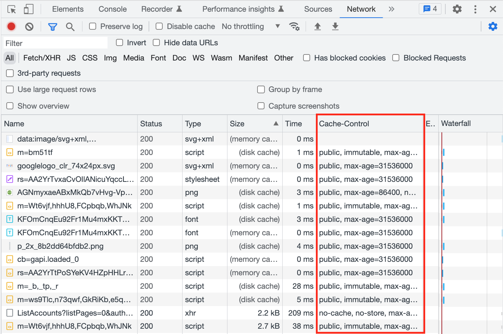
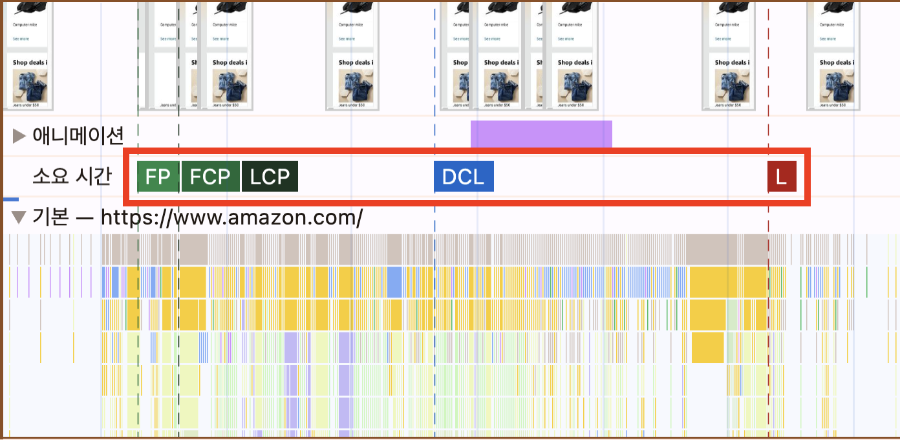
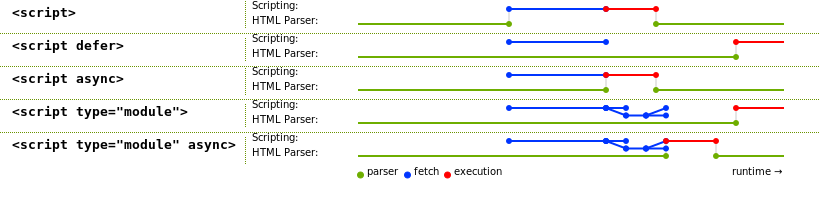
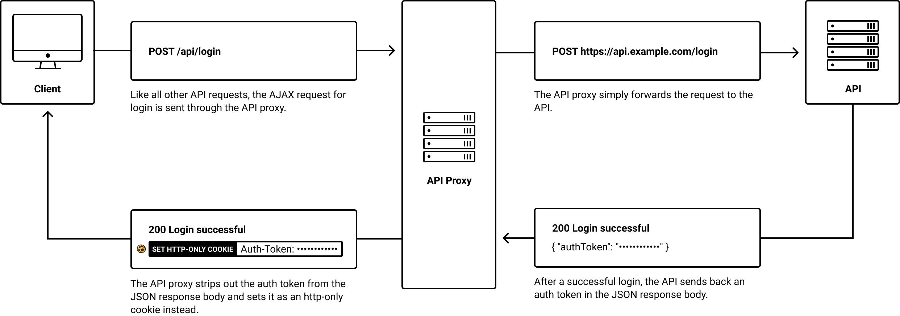

# Browser

* [Communication Process](#communication-process)
* [Rendering Process](#rendering-process)
* [CSR vs SSR](#csr-vs-ssr)
* [Local Storage vs Session Storage vs Cookies](#local-storage-vs-session-storage-vs-cookies)
* [CORS](#cors)
* [Cache](#cache)
* [Web Performance Metrics](#web-performance-metrics)
* [Event Bubbling vs Event Capturing](#event-bubbling-vs-event-capturing)
* [Script](#script)
* [Authentication](#authentication)

## Communication Process
1. DNS 조회를 통해 도메인 이름에 해당하는 IP 주소를 획득
    1. 브라우저 DNS 캐시 확인
    1. OS DNS 캐시 확인
    1. hosts 파일 확인 (로컬에 직접 설정한 도메인-IP 매핑)
    1. 위에서 찾지 못한 경우, DNS 서버에 요청 (Application Layer: DNS protocol, Transport Layer: UDP protocol)
1. 응답받은 IP 주소를 토대로 서버와의 TCP 연결을 진행 (3-way handshake, 1.5 RTT)
    - HTTPS인 경우, TLS handshake 추가 진행 (TLS 1.3 기준 1 RTT)
1. 브라우저가 생성한 HTTP 요청 메시지를 TCP 연결을 통해 서버로 전송
1. 서버는 전달받은 HTTP 요청 메시지를 처리한 후, TCP 연결을 통해 HTTP 응답 메시지를 브라우저로 전송
1. 브라우저는 전달받은 HTTP 응답 메시지를 처리하여 화면에 렌더링
1. TCP 연결 수명 관리 (해제 시, 4-way handshake)
    - HTTP/1.0: 매 요청/응답 후 즉시 연결 종료
    - HTTP/1.1: `Connection: keep-alive` 헤더가 기본 활성화되어 연결을 재사용하며, `Keep-Alive` 헤더를 통해 수명을 관리하고, 도메인당 최대 6개의 연결을 유지하는 Connection Pool 방식으로 HTTP 레벨의 HOL Blocking 현상을 개선
        - `Connection: keep-alive` 헤더와 `Keep-Alive: timeout=N, max=M` 헤더로 설정
        - timeout 시간 동안 요청이 없거나, max 횟수만큼 요청을 처리하면 연결 종료
        - timeout 기본값: Nginx 75초, Node.js 5초
        - 도메인당 여러 TCP 연결을 Connection Pool 방식으로 관리
            - 초기 2개 권장에서 브라우저들이 6개로 확대 (HTTP 레벨의 HOL Blocking 현상 개선)
    - HTTP/2: 멀티플렉싱을 통해 하나의 TCP 연결로 여러 요청 동시 처리 가능하며, HTTP 레벨의 HOL Blocking 현상을 해결
        - 멀티플렉싱: 하나의 TCP 연결을 여러 개의 독립적인 스트림(Stream)으로 나누어 데이터를 주고받는 기술
        - PING 프레임으로 연결 상태 확인, GOAWAY 프레임으로 연결 종료 알림
        - idle timeout 설정에 따라 유휴 연결 종료
        - idle timeout 기본값: Nginx: 180초, Node.js 무제한

[메인으로 가기](https://github.com/sekhyuni/frontend-basic-concept)</br>
[맨 위로 가기](#browser)
## Rendering Process
- 순서
    1. HTML과 CSS를 Parsing하여 DOM Tree와 CSSOM Tree 생성 (Parsing)
    1. DOM Tree와 CSSOM Tree로 Render Tree 구축 (Style)
    1. Render Tree 배치 (Layout)
    1. Layout 결과물을 바탕으로 Paint Records를 생성하며, z-index, position, transform, opacity, filter 등 독립적인 제어가 필요한 요소들은 별도의 레이어를 생성 (Paint)
    1. 분리된 레이어들을 픽셀화하고 (합성 레이어의 경우 GPU가 transform/opacity/filter 변경 처리), 하나로 합쳐서 최종 화면을 출력 (Composite)
- reflow와 repaint
    - reflow
        - 정의: 특정 요소의 속성값이 변경됨에 따라 Render Tree를 재배치하고 Painting 작업을 다시 진행하는 것
        - 대표적인 속성: position, top, right, bottom, left, display, width, height, padding, border, margin, font-size, font-weight, etc.
    - repaint
        - 정의: 특정 요소의 속성값이 변경됨에 따라 Painting 작업을 다시 진행하는 것
        - 대표적인 속성: visibility, border-radius, border-style, box-shadow, outline, text-decoration, color, background, etc.
    - 참고
        - 렌더링 비용: reflow (CPU 처리) > repaint (CPU 처리) > composite (GPU 처리)
        - 일반 레이어 (CPU 처리)
            - z-index, position, 2D transform, opacity < 1, filter 등의 속성이 적용된 요소에 생성
        - 합성 레이어 (GPU 처리)
            - 자동 승격: 3D transform, video/canvas 요소
            - 명시적 승격: 2D transform/opacity/filter + will-change (opacity는 animation/transition 적용 시 임시로 자동 승격)
- 렌더링 최적화
    1. DOM 조작 최소화
        1. 여러 DOM 변경은 DocumentFragment 등을 활용하여 배치 처리 (매 변경마다 reflow가 발생하는 것을 방지)
        1. 브라우저는 스타일 변경을 바로 적용하지 않고 다음 프레임에 모아서 배치 처리 (60fps 기준 약 16.67ms 주기)하지만, 스타일 변경 후 offsetHeight, scrollTop 등 레이아웃 속성을 읽으면 강제로 reflow가 발생하므로 읽기와 쓰기를 분리
    1. 애니메이션 최적화
        1. 애니메이션에는 top, left, width, height 대신 transform 사용 (레이아웃과 페인트 단계를 건너뛰고 composite만 발생하여 GPU 가속을 받을 수 있기 때문)
    1. 합성 레이어 승격
        1. 2D transform/opacity/filter가 자주 변경되는 요소에는 will-change 또는 transform: translateZ(0) 적용하여 합성 레이어로 승격 (단, 과도한 레이어 생성은 메모리 사용량 증가로 이어지므로 주의)
    1. 요소 숨기기
        - 토글 효율: opacity: 0 + pointer-events: none + will-change: opacity (composite) > visibility: hidden (repaint) > display: none (reflow)

[메인으로 가기](https://github.com/sekhyuni/frontend-basic-concept)</br>
[맨 위로 가기](#browser)
## CSR vs SSR
||처리하는 곳|서버 부하|초기 로딩 속도|페이지 리로드|검색엔진최적화 대응|
|:---:|:---:|:---:|:---:|:---:|:---:|
|CSR|Browser|X|상대적으로 느림|X|어려움|
|SSR|Web Server (Node.js, Tomcat, etc.)|O|상대적으로 빠름|O|수월함|
- 참고
    - CSR 방식이 SSR 방식보다 SEO 대응에 불리한 이유: 검색엔진 크롤러가 특정 페이지를 서버에 요청했을 때, SSR 방식과 달리 CSR 방식은 응답 결과에 동적인 컨텐츠가 존재하지 않기 때문
    - CSR 방식에서도 meta 태그를 사용해서 어느 정도 SEO 대응이 가능
    - CSR 방식에서도 Code Splitting을 사용해서 초기 로딩 속도 개선 가능
    - Next.js에서의 SSR은 서버에서 정적 페이지를 생성한 뒤, 클라이언트에서 해당 페이지를 hydrate 하는 방식으로 동작
    - Next.js에서의 Rendering은 CSR과 SSR이 혼합된 방식
        - CSR
            - next/link의 Link 컴포넌트가 클릭됐을 때
            - next/router의 router.push 함수가 호출됐을 때
        - SSR
            - 초기 페이지가 로드됐을 때
            - 페이지가 리로드됐을 때
            - anchor 요소가 클릭됐을 때

[메인으로 가기](https://github.com/sekhyuni/frontend-basic-concept)</br>
[맨 위로 가기](#browser)
## Local Storage vs Session Storage vs Cookies
||크기|수명|저장 장소|접근 가능한 곳|서버로 HTTP 요청 시, 자동 전송 여부|
|:---:|:---:|:---:|:---:|:---:|:---:|
|Local Storage|전체 5MB|수동으로 제거될 때까지|Disk/Browser Memory|Browser|X|
|Session Storage|전체 5MB|수동으로 제거되거나 브라우저 탭이 닫힐 때까지|Browser Memory|Browser|X|
|Cookies|개당 4KB, 도메인당 최대 50~180개 (브라우저마다 상이, Chrome: 180개)|Session Cookies (Expires/Max-Age 미설정): 브라우저 종료 시까지, Persistent Cookies (Expires/Max-Age 설정): 만료 시간까지|Disk/Browser Memory|Browser/Server|O|
- 저장 장소에 대한 부연 설명
    - Local Storage와 Persistent Cookies는 기본적으로 Disk에 저장되며, 브라우저 최초 로딩 시 빠른 접근을 위해 Browser Memory로 캐싱됨
    - Session Cookies는 브라우저 종료 시 삭제되어야 하므로 Browser Memory에만 저장됨
- Cookies에서 가능한 설정
    - HttpOnly: 브라우저 접근 가능 여부 (기본값: false)
    - SameSite: 전송 가능 범위 (기본값: Lax)
        - None: 모든 경우에서 Cookies 전송 가능 (단, Secure: true가 함께 적용되어야 함)
        - Lax
            - SameSite인 경우 Cookies 전송 가능
            - CrossSite인 경우 `<a href="...">`와 같이 최상위 탐색을 유발하는 GET 요청에만 Cookies 전송
        - Strict: SameSite인 경우에만 Cookies 전송 가능
    - Secure: https가 적용된 요청만 전송 가능 여부 (기본값: false, chrome에서 도메인이 localhost인 경우는 예외처리됨)
    - Domain: 도메인 (기본값: 쿠키를 설정한 서버 도메인)
        - eTLD+1을 Domain에 지정하면 그 하위 도메인끼리는 Cookies 공유 가능 (eTLD는 [Public Suffix List](https://publicsuffix.org/list/public_suffix_list.dat)에 등록된 정보를 따름)
- Cross Origin으로 Cookies를 전송하기 위한 설정
    - 조건: 브라우저와 서버 간의 통신에만 해당되며, 서버와 서버 간의 통신에는 해당되지 않음
    - 방법
        - 서버: HTTP Response Header의 Access-Control-Allow-Credentials 속성값을 true로 설정
        - 클라이언트
            - XMLHttpRequest: withCredentials 속성값을 true로 설정
            - fetch: credentials 속성값을 'include'로 설정
            - axios: withCredentials 속성값을 true로 설정

[메인으로 가기](https://github.com/sekhyuni/frontend-basic-concept)</br>
[맨 위로 가기](#browser)
## CORS
- 정의: CORS는 Cross Origin Resource Sharing의 약자이며, 클라이언트와 서버가 교차 출처임에도 서로 상호작용이 가능하도록 도와주는 브라우저의 정책
- 역사: 기존에는 브라우저에서 서버의 응답을 받으려면 Same Origin(동일 출처)일 경우에만 가능했으나, 웹 생태계가 발전하고 서로 다른 Origin임에도 상호작용해야 할 상황들이 많아지면서 CORS 정책의 필요성이 대두되었고, 이에 따라 최초로는 2004년에 Tellme Networks라는 회사에서 도입을 제안한 뒤, 최종적으로는 2014년에 W3C에서 공식적으로 표준화
- 설정: 서버 측에서 HTTP Response Header의 Access-Control-Allow-Origin 속성에 요청을 허용할 클라이언트 측 Origin을 등록
- Preflight Request
    - 정의: 교차 출처 HTTP 요청 전에 서버 측에서 그 요청의 메서드와 헤더에 대해 인식하고 있는지를 체크하는 것
    - 확인하는 것: Access-Control-Request-Headers, Access-Control-Request-Method, Origin
    - 보내는 이유: 서버는 기본적으로 모든 요청에 대해 처리를 하기 때문에 수정이나 삭제와 같은 위험한 요청에 대해서는 먼저 유효성 검증을 한 뒤에 본 요청을 보낼지 말지 결정하기 위함
    - 보내는 조건: 메서드가 GET, POST, HEAD가 아닌 모든 경우 (단, POST는 Content-Type이 application/x-www-form-urlencoded, multipart/form-data, text/plain 중 하나여야 함)
- Simple Request
    - 정의: Preflight Request를 생략하고 곧장 서버로 본 요청을 보내는 것
    - 보내는 조건: 메서드가 GET, POST, HEAD인 경우 (단, POST는 Content-Type이 application/x-www-form-urlencoded, multipart/form-data, text/plain 중 하나여야 함)
    - 프로세스: 요청 자체는 무조건 서버로 보내며, 서버 측에서 HTTP Response Header의 Access-Control-Allow-Origin 속성에 클라이언트 측 Origin이 등록되어 있는지의 여부에 따라 브라우저에서 응답을 차단할지 말지 정함
- Frontend에서 CORS Errors를 우회하는 방법
    - axios 사용 시, baseURL에 API 서버의 Origin을 설정하지 않아야 함 (클라이언트에서 API 서버가 아니라, Proxy 역할을 하는 Frontend 서버로 요청해야 한다는 뜻)
    - Proxy 설정 시, API 서버의 Origin을 설정해야 함 (Proxy 역할을 하는 Frontend 서버에서 API 서버로 요청해야 한다는 뜻)
        1. React
            - setupProxy.js에서 http-proxy-middleware 라이브러리를 사용하여 Proxy 환경 구성 (dev에서만 가능)
                ```javascript
                // setupProxy.js
                const { createProxyMiddleware } = require('http-proxy-middleware');

                const proxy = {
                    target: 'http://{apiServerIP}:{apiServerPort}',
                };

                module.exports = app => {
                    app.use([
                        '/a',
                        '/b',
                        '/c',
                    ],
                        createProxyMiddleware(proxy)
                    );
                };
                ```
                ```typescript
                // index.ts
                import Axios from 'axios';

                const isProd = process.env.NODE_ENV === 'production';

                export const apiServerOrigin = 'http://{apiServerIP}:{apiServerPort}';

                const axios = Axios.create({
                    baseURL: isProd ? apiServerOrigin : '',
                });

                export default axios;
                ```
        1. Next.js
            - next.config.js 파일에 rewrite 설정을 함으로써 Proxy 환경 구성 또는 API Routes를 통해 Proxy 환경 구성 (dev, prod 둘 다 가능)
                ```javascript
                // next.config.js
                /** @type {import('next').NextConfig} */
                const nextConfig = {
                    reactStrictMode: true,
                    async rewrites() {
                        return [
                            {
                                source: '/:path*',
                                destination: 'http://{apiServerIP}:{apiServerPort}/:path*',
                            },
                        ];
                    },
                };

                module.exports = nextConfig;
                ```
                ```typescript
                // index.ts
                import Axios from 'axios';

                const isProd = process.env.NODE_ENV === 'production';

                export const apiServerOrigin = 'http://{apiServerIP}:{apiServerPort}';

                const axios = Axios.create({
                    baseURL: isProd ? apiServerOrigin : '',
                });

                export default axios;
                ```
- Frontend 서버에 Proxy 환경을 구성함으로써 CORS Errors를 우회하는 원리
    1. 브라우저에서 API 요청 시, Proxy 서버로 요청을 보냄 (클라이언트와 Proxy 서버는 Same Origin이므로 별도 설정 없이 상호작용이 가능)
        - Proxy 서버는 로컬에서 실행되는 서버이며, Frontend App이 실행되는 서버와 Proxy 서버가 각각 실행되는 것이 아니라, Frontend App이 실행되는 서버가 Proxy 역할을 수행함. 따라서 Frontend App이 localhost:3000이라는 Host로 실행되면, Proxy 서버의 Host도 localhost:3000가 되는 것임
        - 만약 Proxy 서버가 Frontend App이 실행되는 서버와 다른 Host로 실행된 경우, Proxy 서버에서 응답 헤더의 Access-Control-Allow-Origin 속성에 클라이언트 측 Origin 정보를 등록하면 됨
    1. Proxy 서버로 요청이 들어오면 해당 요청을 API 서버로 보냄
        - Proxy 서버에서 해당 요청을 API 서버로 보낼 수 있는 이유는 브라우저를 통하지 않는 상호작용이기 때문임
    1. API 서버에서 요청 처리 후, 응답을 Proxy 서버로 보냄
    1. Proxy 서버에서 응답을 브라우저로 보냄
        - 만약 Proxy 서버가 Frontend App이 실행되는 서버와 다른 Host로 실행된 경우, 브라우저는 응답 헤더를 확인하여 CORS 설정이 잘 되어있다는 판단 하에 정상 처리
            
[메인으로 가기](https://github.com/sekhyuni/frontend-basic-concept)</br>
[맨 위로 가기](#browser)
## Cache
### 캐시란 무엇인가?
- 정의: 자주 사용되는 데이터를 저장해둔 저장소
- 설정: 서버 측에서 HTTP Response Header의 Cache-Control 속성을 통해 설정
    - no-store: 데이터를 캐싱하지 않음
    - no-cache: 데이터를 캐싱하긴 하지만, 매 요청마다 서버 측에서 유효성 검사를 해야 함
    - max-age={seconds}: {seconds} 동안은 캐싱된 데이터를 사용하며, {seconds}가 지나면 서버 측에서 유효성 검사를 해야 함
    - public: 브라우저, 프록시 서버 등 어디에서든 데이터를 캐싱 가능
    - private: 브라우저에서만 데이터를 캐싱 가능
    - s-maxage={seconds}: 프록시 서버 등 중간 서버에서만 적용되는 속성으로 {seconds} 동안은 캐싱된 데이터를 사용하며, {seconds}가 지나면 서버 측에서 유효성 검사를 해야 함
- 유효성 검사: 클라이언트 측에서 가지고 있던 캐싱된 데이터의 If-None-Match 값과 서버 측에서 생성한 ETag 값을 비교
- Frontend에서 서버의 데이터를 캐싱하는 방법
    - React Query
        - staleTime: staleTime 동안 캐싱된 데이터를 사용함
        - cacheTime: 쿼리가 inactive된 시점부터 cacheTime까지 데이터를 캐싱함
    - Next.js API Routes
        - HTTP Response Header의 Cache-Control 속성을 통해 설정
### 브라우저에서 서버의 데이터를 캐싱하는 방식  

- 브라우저가 데이터를 캐싱하는 장소: 메모리 또는 디스크
    - 브라우저가 데이터를 캐싱할 장소를 정하는 방법: 내부 알고리즘에 의해 결정되며, 이 알고리즘은 브라우저에 따라 다르지만 일반적으로 데이터의 크기, 사용 빈도, 최근에 액세스한 시간 등을 고려하여 결정됨
    - 메모리 캐시 vs 디스크 캐시 성능 비교  
    
        - 메모리 캐시 (브라우저 내부에 존재, hashmap 구조) => 탐색하는데에 약 0ms 소요  
        
        - 디스크 캐시 (브라우저 외부에 존재) => 탐색하는데에 약 30ms ~ 300ms, 최대 1.4s 소요  
        
    - 실제로 데이터를 메모리와 디스크에 캐싱하는 예시
        1. 캐싱된 데이터가 없는 상태로 구글 메인 페이지에 접속하면, 모든 데이터를 서버에서 가져옴  
        
        1. 새로고침을 통해 재접속을 하면, 특정 데이터들은 메모리 또는 디스크에서 가져옴  
        
- 캐싱된 데이터의 유효성 검사 주기를 정하는 방법: 서버에서 응답 헤더의 Cache-Control 속성값으로 max-age={seconds}을 설정  

    ```typescript
    // Express.js Server Example
    const app = express();

    app.get('/api/endpoint', (_, res) => {
        res.set('Cache-Control', 'max-age=3600');

        res.status(200).json({ message: 'success' });
    });
    ```
    1. {seconds}가 지나기 전에는 서버에 데이터 요청을 하지 않고 메모리 또는 디스크에서 캐싱된 데이터를 가져옴
    1. {seconds}가 지나면 캐싱된 데이터를 지우는 것이 아니라, 서버에 유효성 검사 요청을 보냄
        - 유효성 검사는 클라이언트 측에서 가지고 있던 캐싱된 데이터의 If-None-Match 값과 서버 측에서 생성한 ETag 값이 일치하는지 확인하는 과정
        - Nginx, Apache, Tomcat과 같은 대부분의 Web Server(or WAS)는 ETag 값을 통해 캐싱된 데이터의 유효성을 검사하는 프로세스가 기본적으로 내장되어 있음
    1. 유효성 검사 결과, 브라우저에서 가지고 있는 캐싱된 데이터가 유효하면 서버는 304 Not Modified 응답을 보내며, 캐싱된 데이터가 유효하지 않으면 서버는 200 Success 응답을 보내는 동시에 새로운 데이터에 대한 Cache-Control 속성값으로 max-age={seconds}를 갱신함
### 프록시 서버의 캐시
#### Age
- 정의: 응답이 프록시 서버의 캐시에 저장된 후 경과한 시간(초 단위)을 나타내는 응답 헤더
- 특징
    - Date 헤더 기준으로 계산됨 (Age = 현재 시각 - Date)
    - Age가 있으면 프록시 서버를 거쳤음을 의미 (기술적으로는 일반적인 서버에서도 Age를 직접 설정할 수 있으나, 실제로 그렇게 하는 경우는 거의 없음)

[메인으로 가기](https://github.com/sekhyuni/frontend-basic-concept)</br>
[맨 위로 가기](#browser)
## Web Performance Metrics  

1. 페인트 관련 지표
    - FP(First Paint): 픽셀(배경색 등)을 처음 렌더링한 시점
    - FCP(First Contentful Paint): 의미있는 컨텐츠(텍스트, 이미지 등)를 처음 렌더링한 시점
    - LCP(Largest Contentful Paint): 가장 크고 의미있는 컨텐츠(텍스트, 이미지)를 렌더링한 시점
1. 로딩 관련 지표
    - DCL(DOMContentLoaded): HTML 파싱이 완료된 후, 스크립트(+defer 속성이 적용된)의 실행이 완료된 시점
    - L(LOAD): 웹 페이지에 있는 모든 리소스(스크립트, 스타일시트, 이미지, 기타 미디어 파일 등)의 로드가 완료된 시점

[메인으로 가기](https://github.com/sekhyuni/frontend-basic-concept)</br>
[맨 위로 가기](#browser)
## Event Bubbling vs Event Capturing
1. 이벤트 버블링
    - 특정 요소에서 이벤트가 발생하면 최상위에 있는 html 요소까지 이벤트가 전파되어가는 특성
    - 대표적으로 버블링되는 이벤트: click, mousedown, mouseup, wheel, scroll, keydown, keyup
        ```html
        <html>
            <head>
                <style>
                    body {
                        background-color: gainsboro;
                        height: 500px;
                        width: 500px;
                    }

                    .pink-div {
                        position: relative;
                        background-color: pink;
                        height: 200px;
                        width: 200px;
                        display: flex;
                        justify-content: center;
                        align-items: center;
                    }

                    .green-div {
                        position: absolute;
                        top: 0;
                        left: 0;
                        background-color: aquamarine;
                        width: 100px;
                        height: 100px;
                    }
                </style>
            </head>
            <body>
                <div class='pink-div'>
                    <div class='green-div'></div>
                </div>
                <script>
                    const html = document.querySelector('html');
                    const body = document.querySelector('body');
                    const greenDiv = document.querySelector('.green-div');
                    const pinkDiv = document.querySelector('.pink-div');

                    html.addEventListener(
                        'click',
                        () => {
                            console.log('html');
                        }
                    );
                    body.addEventListener(
                        'click',
                        () => {
                            console.log('body');
                        }
                    );
                    pinkDiv.addEventListener(
                        'click',
                        () => {
                            console.log('pink div');
                        }
                    );
                    greenDiv.addEventListener(
                        'click',
                        () => {
                            console.log('green div');
                        }
                    );
                </script>
            </body>
        </html>
        ```
    - 이벤트 버블링을 활용한 예
        - Event Delegation
            - 이벤트가 버블링되는 특성을 활용하여 이벤트 핸들링이 필요한 하위 요소들의 상위 요소가 하위 요소들의 이벤트를 처리하는 패턴
                ```html
                <div>
                    <section style="width: fit-content">
                        <button>Button 1</button>
                        <button>Button 2</button>
                        <button>Button 3</button>
                    </section>
                </div>
                <script>
                    const div = document.querySelector('div');

                    div.addEventListener('click', (event) => {
                        if (event.target.tagName === 'DIV') {
                            console.log('div');
                        }
                        if (event.target.tagName === 'SECTION') {
                            console.log('section');
                        }
                        if (event.target.tagName === 'BUTTON') {
                            console.log(event.target.innerText);
                        }
                    });
                </script>
                ```
            - 구현 순서
                1. 컨테이너에 하나의 핸들러를 할당
                1. 핸들러의 event.target을 사용해서 이벤트가 발생한 요소가 어디인지 알아냄
                1. 원하는 요소에서 이벤트가 발생했다고 확인되면 이벤트를 핸들링
            - 장점
                1. 많은 핸들러를 할당하지 않아도 되기 때문에 초기화가 단순해지고 메모리가 절약됨
                1. 요소를 추가하거나 제거할 때 해당 요소에 할당된 핸들러를 추가하거나 제거할 필요가 없음
            - 단점
                1. 이벤트 위임을 사용하려면 이벤트가 반드시 버블링되어야 하는데, 몇몇 이벤트는 버블링 되지 않음
                1. 컨테이너에 할당된 핸들러가 모든 하위 요소에서 발생하는 이벤트에 응답해야 하므로 CPU 작업 부하가 늘어날 수 있으나, 이런 부하는 무시할만한 수준이므로 실제로는 잘 고려하지 않음
1. 이벤트 캡처링
    - 특정 요소에서 이벤트가 발생했을 때 해당 이벤트가 최상위 요소인 html 요소부터 가장 하위에 있는 요소까지 점점 더 하위 요소들로 전달되어가는 특성
        ```html
        <html>
            <head>
                <style>
                    body {
                        background-color: gainsboro;
                        height: 500px;
                        width: 500px;
                    }

                    .pink-div {
                        position: relative;
                        background-color: pink;
                        height: 200px;
                        width: 200px;
                        display: flex;
                        justify-content: center;
                        align-items: center;
                    }

                    .green-div {
                        position: absolute;
                        top: 0;
                        left: 0;
                        background-color: aquamarine;
                        width: 100px;
                        height: 100px;
                    }
                </style>
            </head>
            <body>
                <div class='pink-div'>
                    <div class='green-div'></div>
                </div>
                <script>
                    const html = document.querySelector('html');
                    const body = document.querySelector('body');
                    const greenDiv = document.querySelector('.green-div');
                    const pinkDiv = document.querySelector('.pink-div');

                    html.addEventListener(
                        'click',
                        () => {
                            console.log('html');
                        },
                        true
                    );
                    body.addEventListener(
                        'click',
                        () => {
                            console.log('body');
                        },
                        true
                    );
                    pinkDiv.addEventListener(
                        'click',
                        () => {
                            console.log('pink div');
                        },
                        true
                    );
                    greenDiv.addEventListener(
                        'click',
                        () => {
                            console.log('green div');
                        },
                        true
                    );
                </script>
            </body>
        </html>
        ```
1. 이벤트 전파 막기
    ```javascript
    event.stopPropagation(); // 버블링 또는 캡처링 전파를 막고 싶을 때
    event.stopImmediatePropagation(); // 버블링 또는 캡처링 전파뿐만 아니라, 현재 실행중인 이벤트 핸들러 이후 어떤 이벤트 핸들러도 실행시키지 않고 싶을 때
    ```
    
[메인으로 가기](https://github.com/sekhyuni/frontend-basic-concept)</br>
[맨 위로 가기](#browser)
## Script  

1. default
    - 동작: 브라우저의 렌더링 엔진이 HTML을 Parsing하다가 script 태그를 만나면 (외부 script의 경우 다운로드 후) 실행한 뒤, 남은 HTML을 Parsing함
    - 문제
        - script 태그 아래에 있는 HTML element에 접근할 수 없기 때문에 HTML element에 이벤트 핸들러를 추가하는 것과 같은 여러 행위를 할 수 없음
        - script 태그가 HTML 상단부에 위치할 경우, (외부 script의 경우 다운로드 후) script를 실행하는 동안 script 태그 하단부에 있는 남은 HTML을 Parsing할 수 없음
    - 해결 방법
        - 단적으로 script 태그를 HTML 하단부에 위치시키면 되지만, HTML 용량이 매우 큰 경우, script 다운로드를 시작하는데에 너무 오랜 시간이 걸린다.
        - defer 또는 async 속성을 사용하면 백그라운드에서 script 다운로드를 시작할 수 있다. 
1. defer
    - 특징
        - script 다운로드를 하는 동안 HTML parsing을 멈추지 않음
        - 다른 script와 동시에 다운로드할 수 있음
        - HTML parsing 완료 -> script 실행 -> DOMContentLoaded 이벤트 발생
        - 여러 개의 스크립트가 있는 경우 선언된 순서대로 실행 (의존성 있는 스크립트군에 적합)
1. async
    - 특징
        - script 다운로드를 하는 동안 HTML parsing을 멈추지 않음
        - 다른 script와 동시에 다운로드할 수 있음
        - HTML parsing 완료, script 실행 순서 간에 의존성 없음
        - DOMContentLoaded 이벤트 발생, script 실행 순서 간에 의존성 없음
        - 여러 개의 스크립트가 있는 경우 응답받은 순서대로 실행 (의존성 없는 스크립트군에 적합)

[메인으로 가기](https://github.com/sekhyuni/frontend-basic-concept)</br>
[맨 위로 가기](#browser)
## Authentication
### HttpOnly & SameSite Cookie를 통한 JWT 인증 방식 (with Next.js API Routes)  

1. 클라이언트에서 인증 서버에 JWT를 달라고 요청함
1. Next.js API Routes를 통해 요청을 대신 받아서 인증 서버에 요청함
1. 인증 서버로부터 Access Token, Refresh Token, Access Token Expires In, Refresh Token Expires In 값을 응답으로 받음
1. Next.js API Routes에서 Access Token과 Refresh Token을 Cookie에 저장 후, 클라이언트에 응답함
    1. HttpOnly, SameSite=Strict, Max-Age=Date.now() + {Access Token Expires In} * 1000을 적용하여 Access Token을 Cookie에 저장
    1. HttpOnly, SameSite=Strict, Max-Age=Date.now() + {Refresh Token Expires In} * 1000을 적용하여 Refresh Token을 Cookie에 저장
1. Middleware에서 모든 페이지 이동 또는 API 호출에 대해 Access Token과 Refresh Token의 만료 여부를 체크하여 각 조건에 맞게 분기 처리
    1. Access Token만 만료된 경우 Refresh Token을 통해 Access Token과 Refresh Token을 재발급 받음
    1. Access Token과 Refresh Token이 모두 만료된 경우 로그인 페이지로 Redirect
1. 클라이언트에서 인증 서버에 로그아웃 요청 시, 마찬가지로 Next.js API Routes를 통해 해당 요청을 인증 서버에 보내고, 인증 서버로부터 응답을 받으면 기존에 있던 Access Token Cookie와 Refresh Token Cookie 속성에 Max-Age=0을 적용하여 클라이언트에 응답함

[메인으로 가기](https://github.com/sekhyuni/frontend-basic-concept)</br>
[맨 위로 가기](#browser)