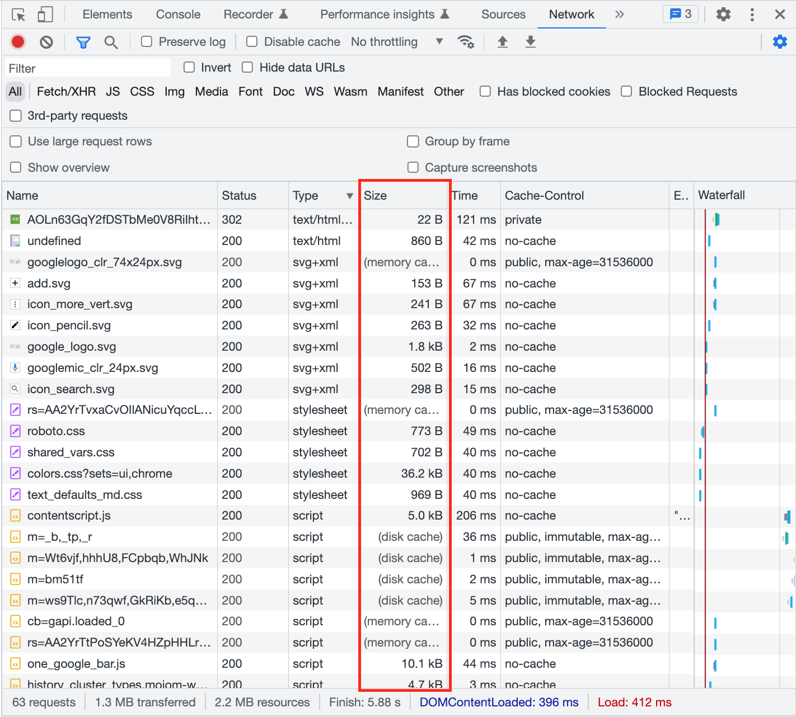

# Browser

* [Rendering Process](#rendering-process)
* [Communication Process](#communication-process)
* [CSR vs SSR](#csr-vs-ssr)
* [Local Storage vs Session Storage vs Cookie](#local-storage-vs-session-storage-vs-cookie)
* [CORS](#cors)
* [Cache](#cache)
* [Event Bubbling vs Event Capturing](#event-bubbling-vs-event-capturing)
* [Authentication](#authentication)

## Rendering Process
- 순서
    1. HTML을 Parsing해서 **DOM Tree**를 생성하고, HTML에 CSS가 포함되어 있다면 **CSSOM Tree**도 함께 생성
    1. DOM Tree와 CSSOM Tree를 합쳐서 **Render Tree**를 생성
    1. Render Tree를 통해 **Layouting**
    1. **Painting**
- 렌더링 최적화
    - Reflow와 Repaint
        - Reflow가 일어나는 대표적인 속성: position, top, right, bottom, left, display, width, height, padding, border, margin, font-size, font-weight, etc.
        - Repaint가 일어나는 대표적인 속성: visibility, border-radius, border-style, box-shadow, outline, text-decoration, color, background, etc. 
        - Reflow와 Repaint 모두 일어나지 않는 대표적인 속성: transform, opacity, etc.
    - 방법
        1. 요소 숨기기
            1. 사용하지 않는 요소에는 visibility: hidden보다 display: none 사용 (display: none으로 처리된 요소는 Reflow가 일어나지 않기 때문)
            1. 사용/미사용이 가끔 변경되는 요소이나, 요소의 위치가 변하면 안되는 경우 visibility: hidden 사용 (display: none으로 처리된 요소는 document에서 완전히 사라지기 때문)
            1. 사용/미사용이 자주 변경되는 요소에는 display: none보다 visibility: hidden 사용 (display 속성 변경으로 인해 Reflow가 일어나기 때문)
            1. 사용/미사용이 자주 변경되는 요소에는 visibility: hidden보다 **가능하면** opacity: 0을 사용 (visibility 속성 변경으로 인해 Repaint가 일어나기 때문)

[메인으로 가기](https://github.com/sekhyuni/frontend-basic-concept)</br>
[맨 위로 가기](#browser)
## Communication Process
- 먼저 www.naver.com의 IP를 찾기 위해 DNS 서버에서 해당 도메인 네임에 매핑된 IP를 얻어오고, 그 다음 해당 IP의 서버와 TCP 연결을 맺게 됩니다. 이후 HTTP 요청이 진행되고, 그에 맞는 HTTP 응답을 받아서 브라우저에 전달 후, 응답받은 페이지가 브라우저에 렌더링되는 순서로 진행되게 됩니다.

[메인으로 가기](https://github.com/sekhyuni/frontend-basic-concept)</br>
[맨 위로 가기](#browser)
## CSR vs SSR
||Where|Initial Loading Speed|Page Reload|SEO Friendly|
|:---:|:---:|:---:|:---:|:---:|
|CSR|Browser|Slower than SSR|X|X|
|SSR|Web Server (Node.js, Tomcat, etc.)|Fast than CSR|O|O|
- Next.js에서의 Rendering은 CSR과 SSR이 혼합된 방식임
    - CSR
        - next/link의 Link 컴포넌트가 클릭됐을 때
        - next/router의 router.push 함수가 호출됐을 때
    - SSR
        - 초기 페이지가 로드됐을 때
        - 페이지가 리로드됐을 때
        - anchor 요소가 클릭됐을 때

[메인으로 가기](https://github.com/sekhyuni/frontend-basic-concept)</br>
[맨 위로 가기](#browser)
## Local Storage vs Session Storage vs Cookie
||Capacity|Storage Space|Expiration|Automatically sent on http request|Accessible|Value Type|
|:---:|:---:|:---:|:---:|:---:|:---:|:---:|
|Local Storage|10MB|Both disk and browser memory|Until manually cleared or deleted|X|All domains and subdomains|string|
|Session Storage|5MB|Only browser memory|Until browser tab is closed|X|All domains and subdomains|string|
|Cookie|4KB|Only browser memory|Until the set expiration time is over|O|All domains and subdomains|string|

[메인으로 가기](https://github.com/sekhyuni/frontend-basic-concept)</br>
[맨 위로 가기](#browser)
## CORS
- 기본적으로 브라우저에서 서버의 응답을 받기 위해서는 Same Origin(Protocol, IP, Port)일 경우에만 가능했으나, Cross Origin Resource Sharing 정책이 등장하면서 Cross Origin인 경우에도 상호작용이 가능해졌음. CORS를 정석적으로 사용하기 위해서는 서버 HTTP 응답 헤더의 Access-Control-Allow-Origin에 클라이언트 Origin 정보를 추가해주면 되며, webpack-dev-server에 Proxy 설정을 함으로써 서버측의 작업없이도 CORS 이슈를 우회하여 해결할 수 있음
- Preflight Request
    - 본격적인 Cross Origin HTTP 요청 전에 **서버 측에서 그 요청의 메서드와 헤더에 대해 인식하고 있는지 체크**하는 것
    - 일반적으로 **브라우저에서 자동적으로 발생**하며, **OPTION 메서드**를 통해 HTTP 요청 헤더에 **Access-Control-Allow-Header, Access-Control-Allow-Methods, Origin** 정보를 담아서 요청
    - 사전 요청을 보냄으로써 **CORS를 인식할 수 없는 서버를 악성 요청으로부터 보호**할 수 있음
- Frontend 서버에 Proxy 설정 시, CORS 이슈 우회 동작 원리
    1. 브라우저에서 API 요청 시, Proxy 서버로 요청을 날림 **(클라이언트와 Proxy 서버는 Same Origin이므로 별도 설정없이 상호작용이 가능)**
        - Proxy 서버는 로컬에서 실행되는 서버이며, Frontend App이 실행되는 서버와 Proxy 서버가 각각 실행되는 것이 아니라, Frontend App이 실행되는 서버가 Proxy 역할을 수행함. 따라서 Frontend App이 localhost:3000이라는 Host로 실행되면, Proxy 서버의 Host도 localhost:3000가 됨
        - 만약 Proxy 서버가 Frontend App이 실행되는 서버와 다른 Host로 실행된다고 해도 Proxy 서버에서 HTTP 응답 헤더의 Access-Control-Allow-Origin에 클라이언트 Origin 정보를 추가해주면 해결됨
    1. Proxy 서버로 요청이 들어오면 해당 요청을 API 서버로 보냄
        - **Proxy 서버에서 해당 요청을 API 서버로 보낼 수 있는 이유는 브라우저를 통하지 않는 상호작용이기 때문임**
    1. API 서버에서 요청 처리 후, 응답을 Proxy 서버로 보냄
    1. Proxy 서버는 전달 받은 **응답 헤더의 Access-Control-Allow-Origin에 클라이언트 Origin을 추가해서 브라우저로 보냄**
    1. 브라우저는 응답 헤더를 확인하여 CORS 설정이 잘 되어있다는 판단 하에 정상 처리함
- 클라이언트에서 자체적으로 CORS 이슈 우회하기
    - Proxy 설정 시, CORS 이슈를 우회할 API 서버의 Origin을 설정해야 함
    - axios 사용 시, baseURL에 API 서버의 Origin을 설정하지 않아야 함
        1. React (setupProxy.js에서 http-proxy-middleware 라이브러리 사용) -> 개발 모드만 가능
            ```javascript
            // setupProxy.js
            const { createProxyMiddleware } = require('http-proxy-middleware');

            const proxy = {
                target: 'http://{apiServerIP}:{apiServerPort}',
            }

            module.exports = app => {
                app.use([
                    '/a',
                    '/b',
                    '/c',
                ],
                    createProxyMiddleware(proxy)
                );
            };
            ```
            ```typescript
            // index.ts
            import Axios from 'axios';

            const isProd = process.env.NODE_ENV === 'production';

            export const apiServerOrigin = 'http://{apiServerIP}:{apiServerPort}';

            const axios = Axios.create({
                baseURL: isProd ? apiServerOrigin : '',
            });

            export default axios;
            ```
        1. Next.js (next.config.js에서 rewrite 함수 설정 사용) -> 개발, 운영 모드 둘다 가능
            ```javascript
            // next.config.js
            /** @type {import('next').NextConfig} */
            const nextConfig = {
                reactStrictMode: true,
                async rewrites() {
                    return [
                        {
                            source: '/:path*',
                            destination: 'http://{apiServerIP}:{apiServerPort}/:path*',
                        },
                    ];
                },
            };

            module.exports = nextConfig;
            ```
            ```typescript
            // index.ts
            import Axios from 'axios';

            const isProd = process.env.NODE_ENV === 'production';

            export const apiServerOrigin = 'http://{apiServerIP}:{apiServerPort}';

            const axios = Axios.create({
                baseURL: isProd ? apiServerOrigin : '',
            });

            export default axios;
            ```
            
[메인으로 가기](https://github.com/sekhyuni/frontend-basic-concept)</br>
[맨 위로 가기](#browser)
## Cache
### 캐시란 무엇인가?
- 자주 사용하는 데이터나 값을 미리 복사해 둔 임시 저장 공간
### 브라우저에서 서버의 리소스를 캐싱하는 방식  

- 브라우저는 **메모리** 또는 **디스크**에 리소스를 캐싱함
    - 브라우저가 캐싱할 장소를 정하는 방법은 내부 알고리즘에 의해 결정되며, 이 알고리즘은 브라우저에 따라 다르지만 일반적으로 **리소스의 크기, 사용 빈도, 최근에 액세스한 시간** 등을 고려하여 결정됨
    - 메모리 캐시 vs 디스크 캐시 성능 비교  
    
        - 메모리 캐시 (브라우저 내부에 존재, hashmap 구조) => 탐색하는데에 약 0ms 소요  
        
        - 디스크 캐시 (브라우저 외부에 존재) => 탐색하는데에 약 30ms ~ 300ms, 최대 1.4s 소요  
        
    - 실제로 리소스를 메모리와 디스크에 캐싱하는 예시
        1. **캐시가 없는 상태**로 구글 메인 페이지에 접속하면, 모든 리소스를 **서버**에서 가져옴  
        
        1. 새로고침을 통해 **재접속**을 하면, 특정 리소스들은 **메모리** 또는 **디스크**에서 캐싱된 리소스를 가져옴  
        
- **리소스의 캐시 검증주기는** 응답 헤더의 **Cache-Control** 속성에 의해 결정되며, 속성값으로는 **max-age와 같은 캐시 유효성 만료시간**에 대한 정보를 설정할 수 있음. max-age가 지나기 전에는 서버에 리소스 요청을 하지 않고 메모리 또는 디스크에서 리소스를 가져옴. max-age가 지나면 서버에 재검증 요청을 보내어 캐시가 유효한지 확인하고, 유효하면 계속해서 캐시에 존재하는 리소스를 사용하는 방식으로 동작함  

    1. **서버에서 Cache-Control 속성값으로 max-age={seconds}를 설정**하면 {seconds}초만큼 클라이언트에서 캐시에 리소스를 저장함
    1. **{seconds}초가 지나면** 캐시에 존재하는 리소스를 지우는 것이 아니라, **서버에 재검증 요청**을 보냄
        - 재검증은 **클라이언트가 가지고 있던 리소스의 ETag값과 서버가 가지고 있는 ETag값이 일치하는지 확인**하는 과정
        - Nginx, Apache, Tomcat과 같은 **대부분의 Web Server(or WAS)는 ETag값을 통해 캐시 유효성을 재검증하는 프로세스가 기본적으로 내장**되어있음
    1. 재검증 결과, 브라우저에서 가지고 있는 **캐시가 유효**하면 서버는 **304 Not Modified** 응답을 보내며, **캐시가 유효하지 않으면** 서버는 **200 Success** 응답을 보내는 동시에 새로운 리소스에 대한 Cache-Control 속성값으로 max-age={seconds}를 갱신함

[메인으로 가기](https://github.com/sekhyuni/frontend-basic-concept)</br>
[맨 위로 가기](#browser)
## Event Bubbling vs Event Capturing
1. 이벤트 버블링
    - 특정 요소에서 이벤트가 발생했을 때 해당 이벤트가 **가장 하위에 있는 요소부터 최상위 요소인 html 요소까지** 점점 더 상위 요소들로 전달되어가는 특성
    - 대표적으로 버블링되는 이벤트: click, mousedown, mouseup, wheel, scroll, keydown, keyup
        ```html
        <html>
            <head>
                <style>
                    body {
                        background-color: gainsboro;
                        height: 500px;
                        width: 500px;
                    }

                    .pink-div {
                        position: relative;
                        background-color: pink;
                        height: 200px;
                        width: 200px;
                        display: flex;
                        justify-content: center;
                        align-items: center;
                    }

                    .green-div {
                        position: absolute;
                        top: 0;
                        left: 0;
                        background-color: aquamarine;
                        width: 100px;
                        height: 100px;
                    }
                </style>
            </head>
            <body>
                <div class='pink-div'>
                    <div class='green-div'></div>
                </div>
                <script>
                    const html = document.querySelector('html');
                    const body = document.querySelector('body');
                    const greenDiv = document.querySelector('.green-div');
                    const pinkDiv = document.querySelector('.pink-div');

                    html.addEventListener(
                        'click',
                        () => {
                            console.log('html');
                        }
                    );
                    body.addEventListener(
                        'click',
                        () => {
                            console.log('body');
                        }
                    );
                    pinkDiv.addEventListener(
                        'click',
                        () => {
                            console.log('pink div');
                        }
                    );
                    greenDiv.addEventListener(
                        'click',
                        () => {
                            console.log('green div');
                        }
                    );
                </script>
            </body>
        </html>
        ```
    - 이벤트 버블링을 활용한 예
        - Event Delegation
            - 이벤트 버블링의 개념을 기반으로 하는 이벤트 처리 패턴
                ```html
                <div>
                    <section style="width: fit-content">
                        <button>Button 1</button>
                        <button>Button 2</button>
                        <button>Button 3</button>
                    </section>
                </div>
                <script>
                    const div = document.querySelector('div');

                    div.addEventListener('click', (event) => {
                        if (event.target.tagName === 'DIV') {
                            console.log('div');
                        }
                        if (event.target.tagName === 'SECTION') {
                            console.log('section');
                        }
                        if (event.target.tagName === 'BUTTON') {
                            console.log(event.target.innerText);
                        }
                    });
                </script>
                ```
            - 구현 순서
                1. 컨테이너에 하나의 핸들러를 할당
                1. 핸들러의 event.target을 사용해서 이벤트가 발생한 요소가 어디인지 알아냄
                1. 원하는 요소에서 이벤트가 발생했다고 확인되면 이벤트를 핸들링
            - 장점
                1. 많은 핸들러를 할당하지 않아도 되기 때문에 초기화가 단순해지고 메모리가 절약됨
                1. 요소를 추가하거나 제거할 때 해당 요소에 할당된 핸들러를 추가하거나 제거할 필요가 없음
            - 단점
                1. 이벤트 위임을 사용하려면 이벤트가 반드시 버블링되어야 하는데, 몇몇 이벤트는 버블링 되지 않음
                1. 컨테이너에 할당된 핸들러가 모든 하위 요소에서 발생하는 이벤트에 응답해야 하므로 CPU 작업 부하가 늘어날 수 있으나, 이런 부하는 무시할만한 수준이므로 실제로는 잘 고려하지 않음
1. 이벤트 캡처링
    - 특정 요소에서 이벤트가 발생했을 때 해당 이벤트가 **최상위 요소인 html 요소부터 가장 하위에 있는 요소까지** 점점 더 하위 요소들로 전달되어가는 특성
        ```html
        <html>
            <head>
                <style>
                    body {
                        background-color: gainsboro;
                        height: 500px;
                        width: 500px;
                    }

                    .pink-div {
                        position: relative;
                        background-color: pink;
                        height: 200px;
                        width: 200px;
                        display: flex;
                        justify-content: center;
                        align-items: center;
                    }

                    .green-div {
                        position: absolute;
                        top: 0;
                        left: 0;
                        background-color: aquamarine;
                        width: 100px;
                        height: 100px;
                    }
                </style>
            </head>
            <body>
                <div class='pink-div'>
                    <div class='green-div'></div>
                </div>
                <script>
                    const html = document.querySelector('html');
                    const body = document.querySelector('body');
                    const greenDiv = document.querySelector('.green-div');
                    const pinkDiv = document.querySelector('.pink-div');

                    html.addEventListener(
                        'click',
                        () => {
                            console.log('html');
                        },
                        true
                    );
                    body.addEventListener(
                        'click',
                        () => {
                            console.log('body');
                        },
                        true
                    );
                    pinkDiv.addEventListener(
                        'click',
                        () => {
                            console.log('pink div');
                        },
                        true
                    );
                    greenDiv.addEventListener(
                        'click',
                        () => {
                            console.log('green div');
                        },
                        true
                    );
                </script>
            </body>
        </html>
        ```
1. 이벤트 전파 막기
    ```javascript
    event.stopPropagation(); // 버블링 또는 캡처링 전파를 막고 싶을 때
    event.stopImmediatePropagation(); // 버블링 또는 캡처링 전파뿐만 아니라, 현재 실행중인 이벤트 핸들러 이후 어떤 이벤트 핸들러도 실행시키지 않고 싶을 때
    ```
    
[메인으로 가기](https://github.com/sekhyuni/frontend-basic-concept)</br>
[맨 위로 가기](#browser)

## Authentication
### HttpOnly & SameSite Cookie를 통한 JWT 인증 방식 (with Next.js API Routes)  

1. 클라이언트에서 인증 서버에 JWT를 달라고 요청함
1. Next.js API Routes를 통해 요청을 대신 받아서 인증 서버에 요청함
1. 인증 서버로부터 Access Token, Refresh Token, Access Token Expires In, Refresh Token Expires In 값을 응답으로 받음
1. Next.js API Routes에서 Access Token과 Refresh Token을 Cookie에 저장 후, 클라이언트에 응답함
    1. HttpOnly, SameSite=Strict, Max-Age=Date.now() + {Access Token Expires In} * 1000을 적용하여 Access Token을 Cookie에 저장
    1. HttpOnly, SameSite=Strict, Max-Age=Date.now() + {Refresh Token Expires In} * 1000을 적용하여 Refresh Token을 Cookie에 저장
1. Middleware에서 모든 페이지 이동 또는 API 호출에 대해 Access Token과 Refresh Token의 만료 여부를 체크하여 각 조건에 맞게 분기 처리
    1. Access Token만 만료된 경우 Refresh Token을 통해 Access Token과 Refresh Token을 재발급 받음
    1. Access Token과 Refresh Token이 모두 만료된 경우 로그인 페이지로 Redirect
1. 클라이언트에서 인증 서버에 로그아웃 요청 시, 마찬가지로 Next.js API Routes를 통해 해당 요청을 인증 서버에 보내고, 인증 서버로부터 응답을 받으면 기존에 있던 Access Token Cookie와 Refresh Token Cookie 속성에 Max-Age=0을 적용하여 클라이언트에 응답함

[메인으로 가기](https://github.com/sekhyuni/frontend-basic-concept)</br>
[맨 위로 가기](#browser)