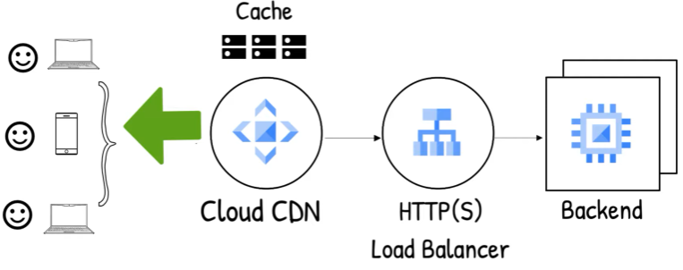

# Infrastructure

* [CDN](#cdn)

## CDN

- 정의: 지리적으로 분산된 Edge Server(Reverse Proxy 역할)를 통해 콘텐츠를 사용자와 가까운 위치에서 빠르게 전달하는 시스템
- 특징
  1. Latency 감소
  1. Cache
- Routing Architecture: Anycast IP + CDN + Load Balancer
	- Anycast IP 기반 요청 분산
    - 동일한 IP 주소를 전 세계 Edge Server에 광고 (BGP 기반)
    - 사용자 요청은 ISP(Internet Service Provider)의 Routing 결정(BGP 경로)에 따라 네트워크 경로상 가장 가까운 Edge Server로 전달
	- CDN과 Load Balancer의 통합
		- Edge Server 내에 CDN과 HTTP(S) Load Balancer가 함께 동작
		- Cache Miss 시, 내부 Load Balancer를 통해 Backend로 요청 전달
- 사용 예시
	1. Image Optimizer를 활용한 브라우저에서의 이미지 로딩 성능 개선
		1. 브라우저에서 이미지를 요청하면, 가장 가까운 Edge Server가 응답
		1. CDN에 캐싱된 데이터가 없을 경우 요청이 Load Balancer를 거쳐 Image Optimizer로 전달됨
		1. Image Optimizer는 원본 이미지를 Storage Bucket에서 가져와 WebP, AVIF 등으로 변환 및 리사이징
		1. 변환된 이미지는 다시 CDN에 캐싱되어, 다음 요청 시 빠르게 응답 가능

[메인으로 가기](https://github.com/sekhyuni/frontend-basic-concept) 
[맨 위로 가기](#infrastructure)
