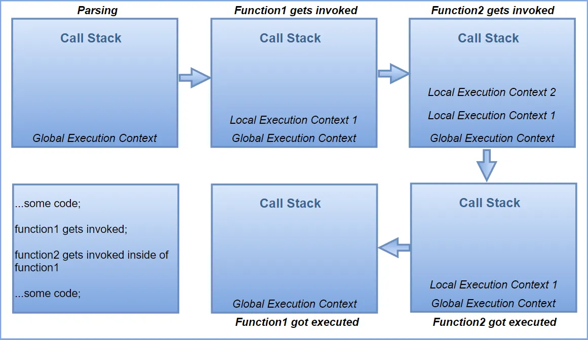

# JavaScript

* [Execution Context](#execution-context)
* [Hoisting](#hoisting)
* [Closure](#closure)
* [Asynchronous Processing](#asynchronous-processing)
* [Prototype](#prototype)
* [First-class object](#first-class-object)
* [Object vs Map](#object-vs-map)

## Execution Context

- 정의: JavaScript Engine에 JavaScript 코드가 로드된 뒤에 코드의 구문을 분석하고 실행을 처리하는 환경이며, 전역 실행 컨텍스트, 함수 실행 컨텍스트, eval 함수 실행 컨텍스트로 구성됨
- 실행 컨텍스트 관점에서 JavaScript 코드가 실행되는 순서
    1. JavaScript Engine에 JavaScript 코드가 로드되면 전역 실행 컨텍스트를 생성하고 Call Stack에 push함
    1. JavaScript Engine은 전역 실행 컨텍스트에서 코드 구문 분석을 진행하며, 이후 코드 맨 윗줄부터 차례대로 코드를 실행함
    1. JavaScript Engine이 함수 호출을 발견하면 함수 실행 컨텍스트를 생성하고 Call Stack에 push함
    1. JavaScript Engine은 함수 실행 컨텍스트에서 코드 구문 분석을 진행하며, 이후 코드 맨 윗줄부터 차례대로 코드를 실행함
    1. JavaScript Engine은 함수 실행이 끝나면 Call Stack에서 함수 실행 컨텍스트를 pop함
    1. JavaScript Engine은 전역 실행 컨텍스트에서 계속해서 코드를 실행하며, 더 이상 실행할 코드가 없다면 Call Stack에서 전역 실행 컨텍스트를 pop함
- 생명 주기
    1. 생성 단계
        - JavaScript 코드의 구문을 분석하고 Lexical Environment와 Variable Environment를 생성
            - Lexical Environment
                - Environment Record: 변수 및 함수 선언이 저장되는 장소이며, Type은 Object와 Declarative로 나뉨
                    - let, const로 선언된 변수가 바인딩되며, 초기화 및 할당은 되지 않음
                    - function으로 선언된 함수가 바인딩된 후 함수 전체가 할당됨
                    - Type이 Declarative인 경우: arguments 객체가 생성됨
                - Reference to the outer environment: 외부 함수의 Lexical Environment에 대한 참조 값
                    - Type이 Object인 경우: null
                    - Type이 Declarative인 경우: GlobalLexicalEnvironment 혹은 OuterFunctionLexicalEnvironment
                - This Binding: 함수 호출 방식에 의해 결정되는 값
                    - Type이 Object인 경우: Global Object
                    - Type이 Declarative인 경우
                        - 일반 함수 호출: Global Object 혹은 (strict mode에서) undefined
                        - 메서드 호출: 해당 메서드를 호출한 객체
                        - 생성자 함수 호출: new 키워드를 통해 새로 생성된 객체
                        - apply/call/bind 호출: 첫 번째 인자로 전달된 객체
                        - 화살표 함수 호출: 외부 함수의 This Binding
            - Variable Environment: Lexical Environment의 일종이며, Environment Record를 제외한 나머지는 Lexical Environment와 동일
                - Environment Record: 변수 선언이 저장되는 장소이며, Type은 Object와 Declarative로 나뉨
                    - var로 선언된 변수가 바인딩된 후 undefined로 초기화됨
            - Lexical Environment와 Variable Environment를 나눈 이유: 변수 선언 키워드별 호이스팅 동작을 일관성 있게 처리하기 위해
    1. 실행 단계
        - 실행 컨텍스트 내에서 코드를 실행

[메인으로 가기](https://github.com/sekhyuni/frontend-basic-concept)</br>
[맨 위로 가기](#javascript)
## Hoisting
- JavaScript 실행 컨텍스트의 생성 단계에서 코드 구문 분석이 이루어지면서 변수 및 함수를 해당 Scope의 최상단으로 끌어올리는 프로세스 (논리적인 개념)
- 모든 선언 키워드는 호이스팅되지만, 호이스팅으로 인해 선언문 전에서도 식별자에 접근 가능한 키워드는 var와 function밖에 없음
- 선언 키워드별 동작 방식
    - var: 선언+초기화, 할당이 각각 따로 실행
        ```javascript
        console.log(someVarVariable);
        var someVarVariable = 1;

        // undefined 출력
        ```
    - let: 선언, 초기화, 할당이 각각 따로 실행 (Temporal Dead Zone 존재)
        ```javascript
        console.log(someLetVariable);
        let someLetVariable = 1;

        // ReferenceError: Cannot access 'someLetVariable' before initialization 출력
        ```
    - const: 선언, 초기화+할당이 각각 따로 실행 (Temporal Dead Zone 존재)
        ```javascript
        console.log(someConstVariable);
        const someConstVariable = 1;

        // ReferenceError: Cannot access 'someConstVariable' before initialization 출력
        ```
    - function: 선언+초기화+할당이 한 번에 실행 (호이스팅으로 인해 실행 단계에서 의도한 대로 동작하는 코드는 함수 선언식의 호이스팅밖에 없음)
        ```javascript
        someFunction();

        function someFunction() {
            console.log('this works');
        }

        // this works
        ```
        ```python
        some_function()

        def some_function():
            print('this does not work')

        # NameError: name 'some_function' is not defined
        ```

[메인으로 가기](https://github.com/sekhyuni/frontend-basic-concept)</br>
[맨 위로 가기](#javascript)
## Closure
- 정의: 외부 함수의 실행 컨텍스트가 소멸되어도 해당 컨텍스트에서 생성되었던 Lexical Environment에 접근할 수 있는 내부 함수
- 클로저가 외부 함수의 Lexical Environment에 접근할 수 있는 이유: 클로저의 Lexical Environment에서 외부 함수의 Lexical Environment에 대한 참조 값을 가지고 있기 때문
- 장점: 실행 컨텍스트가 소멸되어 Lexical Environment에 직접 접근할 수 없으므로 정보를 은닉할 수 있음
- 단점: Lexical Environment가 남아있으므로 사용하지 않는 식별자의 양에 따라 그만큼 메모리 누수가 발생할 수 있음
- 클로저를 활용한 예
    - Debouncing vs Throttling
        1. 디바운씽
            - 동일 이벤트가 반복적으로 일어나는 경우 마지막 이벤트가 일어나고 나서 일정 시간(ms)동안 해당 이벤트가 다시 일어나지 않으면 해당 이벤트의 콜백함수를 실행시키는 기술
                ```html
                <input placeholder='search' />
                <script>
                    const debounce = (callback, delay) => {
                        let timer;
                        return (...args) => {
                            clearTimeout(timer);
                            timer = setTimeout(() => {
                                callback(...args);
                            }, delay);
                        };
                    };

                    const getSearchResults = (keyword) => {
                        return new Promise((resolve, reject) => {
                            setTimeout(() => {
                                resolve(`Results of ${keyword} are ..`);
                            }, 50);
                        });
                    };

                    const searchHandler = async (event) => {
                        const { value } = event.target;
                        const results = await getSearchResults(value);
                        console.log(results);
                    };

                    const optimisedSearchHandler = debounce(searchHandler, 500);

                    const input = document.querySelector('input');
                    
                    input.addEventListener('keyup', (event) => {
                        // searchHandler(event);
                        optimisedSearchHandler(event);
                    });
                </script>
                ```
        1. 쓰로틀링
            - 동일 이벤트가 반복적으로 일어나는 경우 이벤트의 실제 반복 주기와 상관없이 임의로 설정한 일정 시간(ms) 간격으로 콜백함수를 실행시키는 기술
                ```html
                <script>
                    const throttle = (callback, interval) => {
                        let shouldWait = false;
                        return (...args) => {
                            if (shouldWait) {
                                return;
                            }

                            callback();
                            shouldWait = true;
                            setTimeout(() => {
                                shouldWait = false;
                            }, interval);
                        };
                    };

                    const handlerTrigger = () => {
                        console.log('Fire shot');
                    };

                    const optimisedTriggerHandler = throttle(handlerTrigger, 500);

                    window.addEventListener('mousemove', () => {
                        // handlerTrigger();
                        optimisedTriggerHandler();
                    });
                </script>
                ```

[메인으로 가기](https://github.com/sekhyuni/frontend-basic-concept)</br>
[맨 위로 가기](#javascript)
## Asynchronous Processing
- 방법: JavaScript Engine은 Call Stack이 1개이므로 싱글 스레드로 동작하지만, 브라우저 또는 Node.js 런타임 환경에 존재하는 Web API, Event Queue, Event Loop 덕분에 비동기 처리가 가능
- 비동기 처리 과정
    1. JavaScript Engine이 Call Stack에 있는 Task들을 순차적으로 실행하다가 setTimeout 함수를 만나게 되면 setTimeout 함수를 실행하고 Callback 함수를 Web API에 위임
    1. Web API는 Callback 함수를 setTimeout에서 설정된 시간 동안 대기시킨 후, Event Queue로 전달
    1. Event Loop는 주기적으로 Call Stack과 Event Queue를 확인하면서 Call Stack이 비었을 경우 Event Queue에 있는 Task들을 Call Stack으로 전달
    1. Event Loop에 의해 Callback 함수가 Call Stack으로 이동되면 JavaScript Engine이 해당 Callback 함수를 실행
- 브라우저 또는 Node.js 런타임 환경 내 존재하는 컴포넌트
    - Web API: setTimeout, setInterval, XMLHttpRequest, Promise, requestAnimationFrame 등 실질적인 비동기 이벤트 처리 및 비동기 네트워크 통신을 관리
    - Event Queue: 비동기 작업의 Callback 함수가 Call Stack으로 옮겨지기 전에 대기하는 Queue
        - Task가 Call Stack으로 전달되는 순서: Microtask Queue -> Animation Frames -> Task Queue
    - Event Loop: 주기적으로 Call Stack과 Event Queue를 확인하면서 Call Stack이 비었을 경우 Event Queue에 있는 Task들을 Call Stack으로 전달

[메인으로 가기](https://github.com/sekhyuni/frontend-basic-concept)</br>
[맨 위로 가기](#javascript)
## Prototype
- 정의: JavaScript의 모든 객체는 자신의 부모 역할을 담당하는 객체와 연결되어 있는데, 이 부모 역할을 담당하는 객체가 바로 프로토타입
- 특징: JavaScript의 모든 객체는 프로토타입 체인을 통해 다른 객체로부터 상속받은 속성과 메서드를 사용할 수 있음
- 프로토타입에 직접 접근하는 방법
    - Object.getPrototypeOf 메서드 사용
    - __proto__ 속성 사용
- 클래스와 프로토타입의 차이
    - 프로토타입은 동적으로 속성과 메서드를 추가, 수정, 삭제할 수 있음
    - 프로토타입은 여러 개의 인스턴스가 속성과 메서드를 하나의 프로토타입으로부터 공유 받으므로 메모리 사용을 최소화할 수 있음

[메인으로 가기](https://github.com/sekhyuni/frontend-basic-concept)</br>
[맨 위로 가기](#javascript)
## First-class object
- 정의: 다른 객체들에 일반적으로 적용 가능한 연산을 모두 지원하는 객체
- 조건
    - 변수에 할당 가능
    - 매개변수로 전달 가능
    - 반환값으로 사용 가능

[메인으로 가기](https://github.com/sekhyuni/frontend-basic-concept)</br>
[맨 위로 가기](#javascript)
## Object vs Map
1. Object
    - Object는 iterable하지 않음
    - Object의 key는 String 또는 Symbol 타입으로만 설정 가능
    - 빈번한 추가 및 제거 작업에서 Map보다 성능이 낮음
    - Serialization 또는 Parsing을 기본적으로 지원함
    - V8 Engine에서 Object는 Fast Mode 형태(Hash Table로 구현되지 않음)와 Dictionary Mode 형태(Hash Table로 구현되어 있음)를 가질 수 있으며, 최초 선언 시 Fast Mode 형태를 따르고, 이후 삭제 연산이 발생하면 Dictionary Mode 형태로 변경되는 것으로 알려져 있음
        ```javascript
        var obj = {};
        var obj = Object.create(null);
        obj.key = 1;
        obj.key += 10;
        for (const k in obj) obj[k]++;
        let sum = 0;
        for (const v of Object.values(obj)) sum += v;
        if ('key' in obj);
        if (obj.hasOwnProperty('key'));
        delete (obj.key);
        Object.keys(obj).length;
        ```
1. Map
    - Map은 iterable함
    - Map의 key는 모든 타입으로 설정 가능
    - 빈번한 추가 및 제거 작업에서 Object보다 성능이 높음
    - Serialization 또는 Parsing을 기본적으로 지원하지 않음
    - V8 Engine에서 Map은 Hash Table로 구현되어 있음
        ```javascript
        const hashTable = new Map();
        hashTable.set('key', 1);
        hashTable.set('key', hashTable.get('key') + 10);
        hashTable.foreach((k, v) => hashTable.set(k, hashTable.get(k) + 1));
        for (const k of hashTable.keys()) hashTable.set(k, hashTable.get(k) + 1);
        let sum = 0;
        for (const v of hashTable.values()) sum += v;
        if (hashTable.has('key'));
        hashTable.delete('key');
        hashTable.size();
        ```
        
[메인으로 가기](https://github.com/sekhyuni/frontend-basic-concept)</br>
[맨 위로 가기](#javascript)