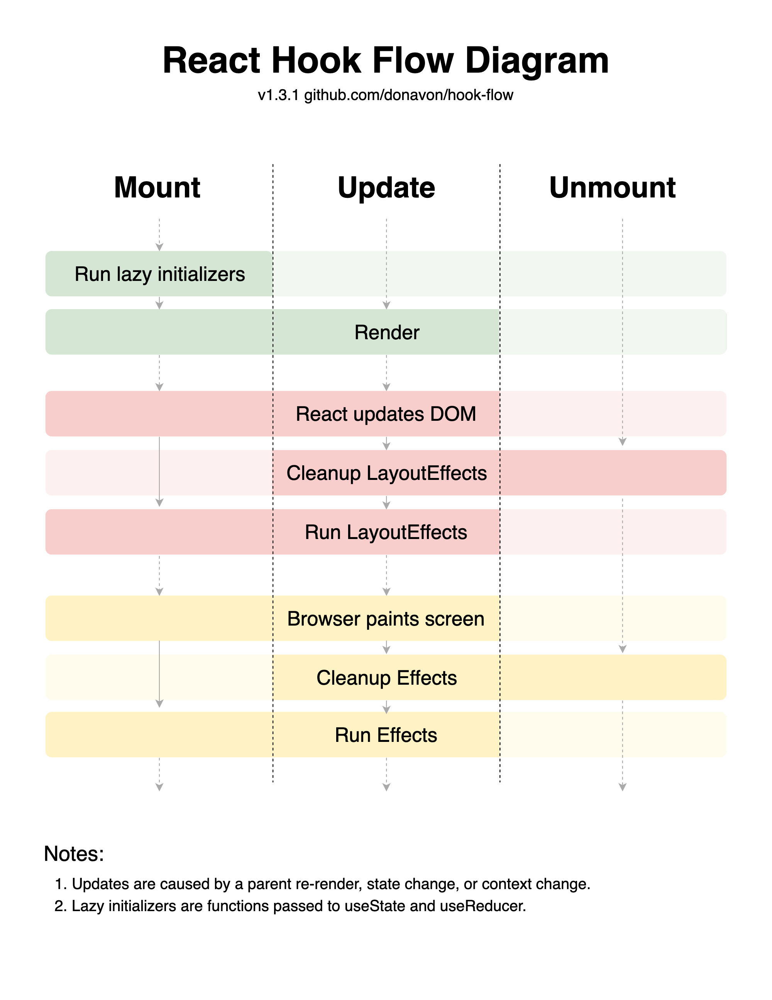

# React

* [Benefits of using React](#benefits-of-using-react)
* [Rendering Process](#rendering-process)
* [Reconciliation](#reconciliation)
* [Life-Cycle](#life-cycle)
* [Hooks](#hooks)
* [Performance Optimization](#performance-optimization)

## Benefits of using React
1. 페이지 이동 시, 앱을 사용하는 듯한 사용자 경험
    - React는 기본적으로 Single Page기반의 CSR 방식을 채택하므로 페이지 이동 시 브라우저단에서 화면을 그리고 데이터만 서버에서 받아옴. 이는 페이지 전부를 가져와야하는 SSR과 다르게 페이지 리로딩이 없기 때문에 앱을 사용하는 듯한 사용자 경험을 제공할 수 있음
1. 높은 렌더링 효율 (feat. 가상 DOM)
    - 변경 사항이 있을 때, 업데이트를 여러 번 하지 않고 한 번만 수행
        - Observable Pattern을 사용하여 약 16ms 버퍼 후, 한 번에 업데이트
    - 이전 가상 DOM과 새 가상 DOM을 비교하고, 실제 DOM에는 변경 사항만 업데이트
        - HTML & Vanilla JavaScript만 사용한 경우 실제 DOM의 요소가 변경되면 해당 요소와 모든 자식 요소가 업데이트
        - HTML & Vanilla JavaScript
            ```html
            <html>
                <body>
                    <div id='root'>
                        <div id='parent'>
                            old parent content
                            <div id='child'>child content</div>
                        </div>
                    </div>
                    <script>
                        let on = true;
                        setInterval(function () {
                            on = !on;
                            document.querySelector('#parent').innerHTML = `
                                ${on ? 'old parent content' : 'new parent content'}
                                <div id="child">child content</div>
                            `;
                        }, 1000);
                    </script>
                </body>
            </html>
            ```
        - React
            ```jsx
            import React, { useState, useEffect, useRef } from 'react';

            const useInterval = (callback, delay) => {
                const savedCallback = useRef();

                useEffect(() => {
                    savedCallback.current = callback;
                }, [callback]);

                useEffect(() => {
                    const tick = () => {
                        savedCallback.current();
                    };

                    if (delay) {
                        const intervalId = setInterval(tick, delay);
                        return () => {
                            clearInterval(intervalId);
                        };
                    }
                }, []);
            }

            const App = () => {
                const [on, setOn] = useState(true);

                useInterval(function () {
                    setOn(!on);
                }, 1000);

                return (
                    <div id='parent'>
                        {on ? 'old parent content' : 'new parent content'}
                        <div id='child'>child content</div>
                    </div>
                );
            };

            export default App;
            ```
1. 선언형 프로그래밍으로 인한 가독성, 예측성, 유지보수성 향상
    - 선언형 프로그래밍: What에 집중 -> 무엇을 구현할 것인지 기술 -> 가독성, 예측성, 유지보수성 향상
        - React
            ```jsx
            const App = () => {
                const arr = [1, 2, 3, 4, 5];
                return (
                    <ul>
                        {arr.map((LIElement) => (
                            <li>{LIElement}</li>
                        ))}
                    </ul>
                );
            };
            ```
    - 명령형 프로그래밍: How에 집중 -> 어떻게 구현할 것인지 기술 -> 처리 속도는 빠르나, 가독성, 예측성, 유지보수성 저하 
        - jQuery
            ```html
            <html>
            <body>
                <ul></ul>
                <script>
                    const arr = [1, 2, 3, 4, 5];
                    for (let i = 0; i < arr.length; i++) {
                        $('ul').append($('<li>').prop({ innerHTML: arr[i] }));
                    }
                </script>
            </body>
            </html>
            ```
1. 다양한 라이브러리와 플러그인 지원
1. 타 프론트엔드 프레임워크 대비 큰 개발 커뮤니티
    - 개발/운영간 이슈 발생 시, 다른 개발자들의 도움을 손쉽게 받을 수 있음

[메인으로 가기](https://github.com/sekhyuni/frontend-basic-concept)</br>
[맨 위로 가기](#react)
## Rendering Process
- React의 Rendering Process는 Render Phase와 Commit Phase로 이루어짐
- Render: 새 가상 DOM을 생성하고 이전 가상 DOM이 있다면 새 가상 DOM과 비교하는 단계
    1. React App이 최초 실행된 경우
        1. Component가 parsing되고 JSX가 React.createElement를 통해 React Element로 변환되고 메모리에 저장
        1. React Element를 통해 새 가상 DOM을 생성
    1. state 또는 props가 업데이트된 경우
        1. 상태 변경을 트리거한 Component에 플래그를 지정
        1. Component와 하위 Component들이 parsing되고 JSX가 React.createElement를 통해 React Element로 변환되고 메모리에 저장
        1. React Element를 통해 새 가상 DOM을 생성
        1. Diffing 알고리즘을 통해 이전 가상 DOM과 새 가상 DOM을 비교
- Commit: 새 가상 DOM 또는 변경 사항을 실제 DOM에 업데이트하는 단계
    1. React DOM 라이브러리를 사용하여 새 가상 DOM 또는 변경 사항을 실제 DOM에 업데이트

[메인으로 가기](https://github.com/sekhyuni/frontend-basic-concept)</br>
[맨 위로 가기](#react)
## Reconciliation
- Reconciliation이란 이전 가상 DOM과 새 가상 DOM을 비교하고 변경 사항을 실제 DOM에 업데이트하는 과정 (Render + Commit)
- React는 이전 가상 DOM과 새 가상 DOM을 비교하기 위해 아래 2가지 가정을 기반한 시간 복잡도 O(n)의 Diffing 휴리스틱 알고리즘을 사용
    1. 서로 다른 타입의 두 Elements는 서로 다른 Tree를 만들어냄
    1. 개발자가 key prop을 통해, 여러 렌더링 사이에서 어떤 자식 Element가 변경되지 않아야 할 지 표시해 줄 수 있음
- 비교 알고리즘 (Diffing Algorithm)
    - React가 두 개의 트리를 비교하는 시기: **state 또는 props가 업데이트**됐을 때
    - 가장 먼저 비교하는 것: 두 개의 **Root Elements**
    1. 다른 타입의 Elements
        - 두 Root Elements의 타입이 다르면, React는 이전 Tree를 버리고 완전히 새로운 Tree를 구축
            ```tsx
            import { useState, useEffect } from 'react';

            const App = (): JSX.Element => {
                const [tagName, setTagName] = useState<string>('div');
                const TagName = tagName as keyof JSX.IntrinsicElements;

                return (
                    <TagName>
                        <button onClick={() => {
                            setTagName('article');
                        }}>
                            Change Tag Name to destroy ChildComponent
                        </button>
                        <ChildComponent />
                    </TagName>
                );
            };

            const ChildComponent = (): JSX.Element => {
                useEffect(() => {
                    console.log('ChildComponent --> render');

                    return () => {
                        console.log('ChildComponent --> unMount');
                    };
                }, []);

                return <div></div>;
            };

            export default App;
            ```
    1. 같은 타입의 DOM Elements
        - 같은 타입의 DOM Elements를 비교할 때, React는 두 Elements의 속성을 확인하여, 동일한 내역은 유지하고 변경된 속성들만 갱신
        - DOM 노드의 처리가 끝나면, React는 이어서 해당 노드의 자식들을 재귀적으로 처리
            ```tsx
            import { useState, useEffect } from 'react';

            const App = (): JSX.Element => {
                const [isBefore, setIsBefore] = useState<boolean>(true);

                return (
                    <div
                        className={isBefore ? 'before' : 'after'}
                        style={{ color: isBefore ? 'red' : 'green', fontWeight: 'bold' }}
                        title='stuff'
                    >
                        <button onClick={() => {
                            setIsBefore(false);
                        }}>Press me to update attributes</button>
                        <ChildComponent />
                    </div>
                );
            };

            const ChildComponent = (): JSX.Element => {
                useEffect(() => {
                    console.log('ChildComponent --> render');

                    return () => {
                        console.log('ChildComponent --> unMount');
                    };
                }, []);

                return <div></div>;
            };
            
            export default App;
            ```
    1. 같은 타입의 Component Elements
        - Component가 갱신되면 인스턴스는 동일하게 유지되어 렌더링 간 state가 유지됨. React는 새로운 Element의 내용을 반영하기 위해 현재 Component 인스턴스의 props를 갱신함. 이때 해당 인스턴스의 UNSAFE_componentWillReceiveProps(), UNSAFE_componentWillUpdate(), componentDidUpdate를 호출
        - 다음으로 render() 메서드가 호출되고 비교 알고리즘이 이전 결과와 새로운 결과를 재귀적으로 처리
    1. 자식에 대한 재귀적 처리
        - DOM 노드의 자식들을 재귀적으로 처리할 때, React는 기본적으로 **동시에 두 리스트를 순회하고 차이점이 있으면 변경을 생성**
        - 자식들이 key를 가지고 있다면, React는 **key를 통해 이전 Tree와 새로운 Tree의 자식들이 일치하는지 확인**함. 예를 들어, 아래 예시에서 ChildComponentMemo에 key를 추가하여 Tree의 변환 작업이 효율적으로 수행되도록 수정할 수 있음
            ```tsx
            import React, { useState } from 'react';

            const App = (): JSX.Element => {
                const [counts, updateCount] = useState<number[]>(
                    Array.from({ length: 10000 }, (_, i) => i)
                );

                return (
                    <>
                        <button onClick={() => updateCount([counts.length + 1, ...counts])}>
                            Press me
                        </button>
                        <ul>
                            {counts.map((item: number) => (
                                // key를 넣지 않은 경우
                                // <ChildComponentMemo text={item} />

                                // key를 넣은 경우
                                <ChildComponentMemo key={item} text={item} />
                            ))}
                        </ul>
                    </>
                );
            };

            const ChildComponent = (props: { text: number }): JSX.Element => {
                const [state] = useState<number>(props.text);

                console.log('ChildComponent --> re-render');

                return (
                    <li>
                        state: {state} -- text props: {props.text}
                    </li>
                );
            };

            const ChildComponentMemo = React.memo(ChildComponent);

            export default App;
            ```
- 정리
    1. Reconciliation
        - 정의: 이전 가상 DOM가 새 가상 DOM을 비교하여 실제 DOM에 업데이트하는 과정
        - 비교 방법: Diffing 휴리스틱 알고리즘이라는 시간 복잡도 O(n)의 비교 알고리즘 사용
        - 시간 복잡도 O(n)을 만족시키기 위한 조건
            - 서로 다른 타입의 두 Elements는 서로 다른 Tree를 생성하기 때문에 항상 같은 타입의 Elements가 렌더링되도록 구현해야 함
            - 형제 노드 사이에서 재정렬이 발생하는 경우 어떤 노드가 변경되지 않아도 되는지 알려주기 위해 항상 unique한 key를 표시해야 함
    1. React에서 key의 역할
        - Reconciliation이 진행될 때, 형제 노드 사이에서 재정렬이 발생하는 경우 어떤 노드가 변경되지 않아도 되는지 알려주는 역할
            - 각 노드의 key가 항상 unique한 경우 DOM Element의 속성 또는 Component Element의 props를 갱신하지 않아도 됨
            - 각 노드의 key가 항상 unique하지 않을 경우 DOM Element의 속성 또는 Component Element의 props를 갱신하기 때문에 성능적으로 좋지 않음 (최악의 경우 모든 형제 노드의 속성 또는 props가 변경됨)

[메인으로 가기](https://github.com/sekhyuni/frontend-basic-concept)</br>
[맨 위로 가기](#react)
## Life-Cycle
- 순서: Mount -> Update -> Unmount  

- 상태
    - Mount
        - 정의: Component가 최초 렌더링 되어 DOM을 조작할 수 있는 상태 
        - 순서: Run lazy initializers -> Render -> React updates DOM -> Run LayoutEffects -> Browser paints screen -> Run Effects
        - 특징
            - Class Component에서의 componentDidMount는 Browser Painting 완료 후 동기적으로 호출되지만, Functional Component에서의 useEffect는 Browser Painting 완료 후 비동기적으로 호출됨
    - Update
        - 정의: Component 내 props나 state 값이 변경되면서 Component가 리렌더링 되어 변경된 DOM을 조작할 수 있는 상태
        - 순서: Render -> React updates DOM -> Cleanup LayoutEffects -> Run LayoutEffects -> Browser paints screen -> Cleanup Effects -> Run Effects
        - 특징
            - Parent-Child Component상에서의 호출 순서: Parent Render -> Child Render -> Child Cleanup LayoutEffects -> Parent Cleanup LayoutEffects -> Child Run LayoutEffects -> Parent Run LayoutEffects -> Child Cleanup Effects -> Parent Cleanup Effects -> Child Run Effects -> Parent Run Effects
    - Unmount
        - 정의: Component가 페이지 상에서 사라진 상태
        - 순서: Cleanup LayoutEffects -> Cleanup Effects
- 부가 개념
    - Cleanup
        - Cleanup Trigger 조건
            1. Update
            2. UnMount
        - Cleanup 과정
            1. Update: Component 내 props나 state 값이 변경 -> Render (최신 state를 보고 있음) -> Cleanup LayoutEffects (이전 렌더링에서 들고 있던 state를 보고 있음) -> Run LayoutEffects (최신 state를 보고 있음) -> Cleanup Effects (이전 렌더링에서 들고 있던 state를 보고 있음) -> Run Effects (최신 state를 보고 있음)
            2. UnMount: Component가 페이지 상에서 사라짐 -> Cleanup LayoutEffects (이전 렌더링에서 들고 있던 state를 보고 있음) -> Cleanup Effects (이전 렌더링에서 들고 있던 state를 보고 있음)
        - Cleanup이 필요없는 effect: 네트워크 요청, DOM 조작, 로깅 등
        - Cleanup이 필요한 effect: 이벤트 리스너 추가, 타이머 추가 등
            - Cleanup을 하지 않았을 때 발생 가능한 버그: 예를 들어 특정 페이지에서만 사용할 목적으로 window에 Event Listener 설정 후 Cleanup을 하지 않고 다른 페이지로 넘어가면, 해당 Event 발생 시 Event Handler 함수가 호출됨

[메인으로 가기](https://github.com/sekhyuni/frontend-basic-concept)</br>
[맨 위로 가기](#react)
## Hooks
1. useState
    - 정의
        - 상태값을 다루기 위한 Hook
    - 필요한 곳
        - Component Life-Cycle동안 값을 매 렌더링마다 초기화하고 싶지 않을 때
        - 값이 업데이트되면서 화면이 새로 바뀌어야 할 때
1. useEffect
    - 정의
        - DOM이 Mount(Commit Phase) 완료 후, Browser Painting까지 완료 후에 비동기적으로 호출되는 Hook
        - Component Tree 외부에 있는 것들을 props나 state에 따라 동기화하는 것
        - 의존성 배열 내에는 props나 state뿐만 아니라 ref.current도 포함될 수 있음
    - 필요한 곳
        - 네트워크 요청, DOM 조작, 이벤트 리스너 추가, 타이머 추가, 로깅 등의 side effects를 유발하는 작업을 실행해야 할 때
    - 일반적으로 useEffect 내에서 해야하는 작업을 useEffect 외부에서 하면 안되는 이유
        - 네트워크 요청 후 응답 데이터를 통해 상태 업데이트를 하려는 경우, 렌더링 프로세스가 정상적으로 진행되지 않을 것이기 때문
        - DOM을 조작하려는 경우, DOM이 Mount되기 전이므로 DOM에 접근할 수 없을 것이기 때문
1. useRef
    - 정의
        - DOM 요소 접근 또는 특정 값을 담기 위한 객체를 반환하는 Hook
    - 필요한 곳
        1. DOM 요소 접근
        1. 특정 값을 담기
            - Component Life-Cycle동안 값을 매 렌더링마다 초기화하고 싶지 않을 때
            - 값이 업데이트되면서 화면이 새로 바뀌지 않아도 될 때
            - 값이 업데이트되는 즉시 해당 값을 Component 내부에서 사용하고 싶을 때
                ```tsx
                import { useState, useRef } from 'react';

                const App = (): JSX.Element => {
                    const refObject = useRef<number>(1);
                    const rawObject = { current: 1 };

                    const [isChanged, setIsChanged] = useState<boolean>(false);

                    return (
                        <>
                            <button onClick={() => {
                                refObject.current = 2;
                                rawObject.current = 2;
                            }}>값 변경</button>
                            <button onClick={() => {
                                setIsChanged(true);
                            }}>리렌더링</button>
                            <button onClick={() => {
                                console.log(refObject.current);
                                console.log(rawObject.current);
                            }}>값 확인</button>
                        </>
                    );
                };

                export default App;
                // 값 변경 버튼 클릭 -> 리렌더링 버튼 클릭 -> 값 확인 버튼 클릭 시,
                // refObject.current는 2 출력 (useRef가 반환한 객체는 Life-Cycle동안 값을 유지)
                // rawObject.current는 1 출력 (일반 JavaScript 객체는 리렌더링 시 값이 초기화됨)
                ```
1. useCallback
    - 정의
        - 함수를 메모이제이션하기 위해서 사용되는 Hook
    - 필요한 곳
        - 자식 Component가 React.memo로 Wrapping되어 있고, 해당 자식 Component에 함수를 props로 전달해야 할 때
    - 주의사항
        - 메모이제이션함으로써 추가적인 메모리를 더 사용해야 하고, 이전 렌더링에서의 함수 참조값과 새 렌더링에서의 함수 참조값을 비교하는 추가적인 복잡도가 존재한다는 점을 고려해야 함
1. useMemo
    - 정의
        - 값을 메모이제이션하기 위해서 사용되는 Hook
    - 필요한 곳
        - 자식 Component가 React.memo로 Wapping되어 있고, 해당 자식 Component에 배열 또는 객체를 props로 전달해야 할 때
        - 굉장히 오래 걸리는 연산의 반환값을 다루어야 할 때
            ```tsx
            import { useState, useMemo } from 'react';

            const CounterButton = ({ counter, setCounter }: { counter: number; setCounter: (counter: number) => void }): JSX.Element => {
                return (
                    <div>
                        <button style={{
                            border: 'none',
                            borderRadius: '10px',
                            fontSize: '18px',
                            backgroundColor: 'skyblue',
                            cursor: 'pointer',
                        }}
                            onClick={() => {
                                setCounter(counter + 1);
                            }}>카운터 업데이트</button>
                    </div>
                );
            };

            const OtherCounterButton = ({ otherCounter, setOtherCounter }: { otherCounter: number; setOtherCounter: (otherCounter: number) => void }): JSX.Element => {
                return (
                    <div>
                        <button style={{
                            border: 'none',
                            borderRadius: '10px',
                            fontSize: '18px',
                            backgroundColor: 'red',
                            cursor: 'pointer',
                        }}
                            onClick={() => {
                                setOtherCounter(otherCounter + 1);
                            }}>다른 카운터 업데이트</button>
                    </div>
                );
            };

            const App = (): JSX.Element => {
                const [counter, setCounter] = useState<number>(0);
                const [otherCounter, setOtherCounter] = useState<number>(0);
                const doubleNumber = useMemo(() => {
                    return slowFunction(counter);
                }, [counter]);
                // const doubleNumber = slowFunction(counter);

                return (
                    <div style={{
                        display: 'flex',
                        flexDirection: 'column',
                        justifyContent: 'center',
                        alignItems: 'center',
                        height: '100vh',
                    }}>
                        <div style={{
                            display: 'flex',
                            flexDirection: 'row',
                            alignItems: 'center',
                        }}>
                            <p>카운터: {counter}</p>
                            <CounterButton counter={counter} setCounter={setCounter} />
                        </div>
                        <div style={{
                            display: 'flex',
                            flexDirection: 'row',
                            alignItems: 'center',
                        }}>
                            <p>다른 카운터: {otherCounter}</p>
                            <OtherCounterButton otherCounter={otherCounter} setOtherCounter={setOtherCounter} />
                        </div>
                        <p>카운터 X 2: {doubleNumber}</p>
                    </div>
                );
            };

            const slowFunction = (num: number): number => {
                for (let i = 0; i < 500000000; i++) { }
                return num * 2;
            }

            export default App;
            ```
    - 주의사항
        - 메모이제이션함으로써 추가적인 메모리를 더 사용해야 하고, 이전 렌더링에서의 함수 참조값과 새 렌더링에서의 함수 참조값을 비교하는 추가적인 복잡도가 존재한다는 점을 고려해야 함
1. useLayoutEffect
    - 정의
        - DOM이 Mount(Commit Phase) 완료 후, Browser Painting하기 전에 동기적으로 호출되는 Hook
    - 필요한 곳
        - Browser Local Storage에 들어있는 로그인 상태값를 가져와서 그에 맞는 화면에 보여주는 등 Browser Painting하기 전에 값을 가져올 수 있을 때
            ```tsx
            import { useState, useEffect, useLayoutEffect } from 'react';

            localStorage.setItem('isLogin', 'true');

            const App = () => {
                const [isLogin, setIsLogin] = useState<string>('false');

                useLayoutEffect(() => {
                    for (let i = 0; i < 100000000; i++) {}
                    setIsLogin(localStorage.getItem('isLogin') as string);
                }, []);

                // useEffect(() => {
                //   for (let i = 0; i < 100000000; i++) {}
                //   setIsLogin(localStorage.getItem('isLogin') as string);
                // }, []);

                return (
                    <div>
                        {JSON.parse(isLogin) ? 'You are logged in' : 'You are not logged in'}
                    </div>
                );
            };

            export default App;
            ```
    - 주의사항
        - 동기적으로 호출되므로 많은 로직이 존재할 경우, 사용자가 화면을 보기까지 시간이 오래 걸릴 수 있음
            ```tsx
            import { useEffect, useRef, useLayoutEffect } from 'react';

            const App = (): JSX.Element => {
                const inputRef = useRef<HTMLInputElement | null>(null);
                
                useEffect(() => {
                    inputRef.current.value = 'another user';
                });

                useLayoutEffect(() => {
                    console.log(inputRef.current.value);
                });
                
                return (
                    <div>
                        <input type='text' value='EmmanuelTheCoder' ref={inputRef} />
                    </div>
                );
            }
            
            export default App;
            // 화면에는 "another user"가 나오지만, 콘솔에는 "EmmanuelTheCoder"가 찍힘
            ```

[메인으로 가기](https://github.com/sekhyuni/frontend-basic-concept)</br>
[맨 위로 가기](#react)
## Performance Optimization
1. Input Element
    - 기존
        ```tsx
        import { useState, FormEvent, ChangeEvent } from 'react';

        const App = (): JSX.Element => {
            const [inputState, setInputState] = useState<string>('');

            return (
                <form onSubmit={(event: FormEvent<HTMLFormElement>) => {
                    event.preventDefault();

                    // do something with inputValue
                }}>
                    <input value={inputState} onChange={(event: ChangeEvent<HTMLInputElement>) => {
                        setInputState(event.target.value);
                    }} />
                </form>
            );
        };

        export default App;
        ```
    - 개선
        ```tsx
        import { useRef, FormEvent } from 'react';

        const App = (): JSX.Element => {
            const inputRef = useRef<HTMLInputElement | null>(null);

            return (
                <form onSubmit={(event: FormEvent<HTMLFormElement>) => {
                    event.preventDefault();

                    if (!inputRef.current) {
                        return;
                    }

                    // do something with inputRef.current.value
                }}>
                    <input ref={inputRef} />
                </form>
            );
        };

        export default App;
        ```
        
[메인으로 가기](https://github.com/sekhyuni/frontend-basic-concept)</br>
[맨 위로 가기](#react)